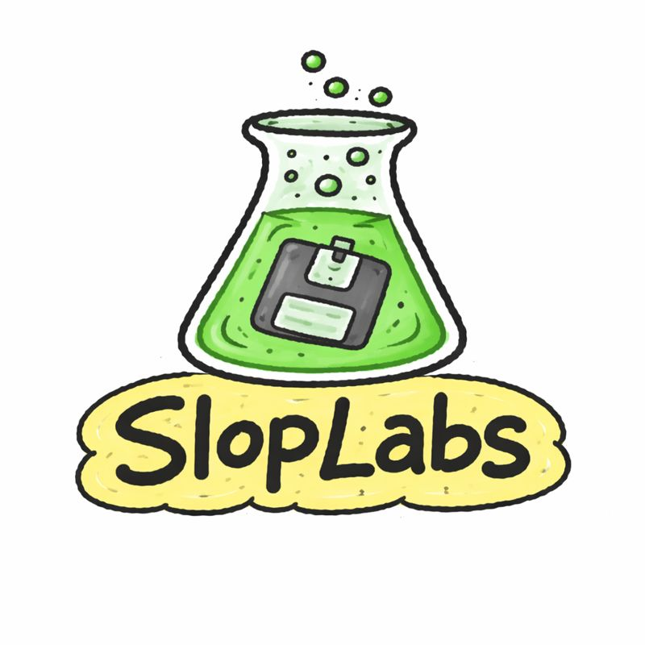

  
  
  
  

  

  <i>SlopLabs is an AI-native systems studio. 
  We build programs, kernels, and experiments where AI co-authors every layer. 
  We iterate fast, publish often, and keep everything open.</i>

  <b>Build fast → publish the trail. 
  Invite collaborators → ship the next drop. 
  The lab is always open.</b>

---

 

## Projects

A living catalog of AI-built systems.

| Project | Summary | Status | Links |
| --- | --- | --- | --- |
| **SlopOS** | A complete operating system with a Rust kernel built entirely by AI. | Active | [Website](https://slopos.sloplabs.net) · [Repo](https://github.com/SlopLabs/slopos) |

Want to add a new project? Edit the `projects` array in `src/app/page.tsx`.

 

---

 

## Approach

| | Principle |
|:--:|---------|
| | **AI-first workflow** — Prompt logs + verification checklists for every system |
| | **Open repositories** — Everything lives on GitHub with issues labeled for onboarding |
| | **Design for change** — Modular stacks and contract tests keep systems flexible |

 

---

 

## Lab Status

| | Signal |
|:--:|---------|
| | Primary repo: 1 |
| | Systems in flight: 1 |
| | AI copilots: 4 |

 

---

 

## Connect

- Website: https://sloplabs.net
- GitHub: https://github.com/SlopLabs

 

  
    <i>SlopLabs builds in the open with AI, always.</i>
  

